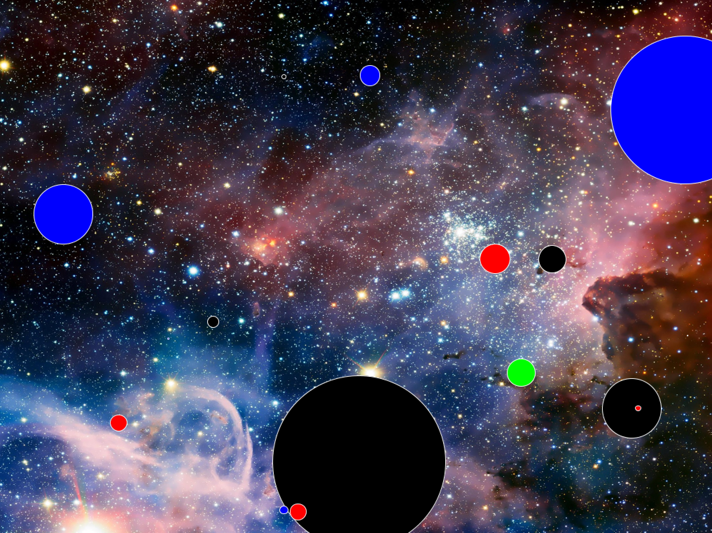

# Space Consumers 

I made this weird little game 2013 as part of CS101 at NYU. The class was in Java and this project was meant to display my understanding of interfaces.

The game has something to do with being a black hole that consumes other space things or something? I can't really remember.

It's written in Java and using the Processing library's PApplet to draw the visualization, as well as the Minim library to make cool space sounds link blink and zoink.

## Running Instructions
- Make sure you are running Java 8 as the processing library doesn't seem to work with anything newer
- Run `mvn clean compile assembly:single` to create a jar with the processing dependency
- Run the jar: `java -jar target/consumers-1.0-SNAPSHOT-jar-with-dependencies.jar`

## A Note About Code Quality

This is one of the first applications I ever wrote, so the code quality is... how do I put this... real bad. I wanted to preserve the code as I originally wrote it because it makes me proud of how much I've learned since I wrote this, but I also couldn't stand to look at it without doing a bit of refactoring. The legible version of the app lives in the branch 2019-refactor if you'd like to take a look.

